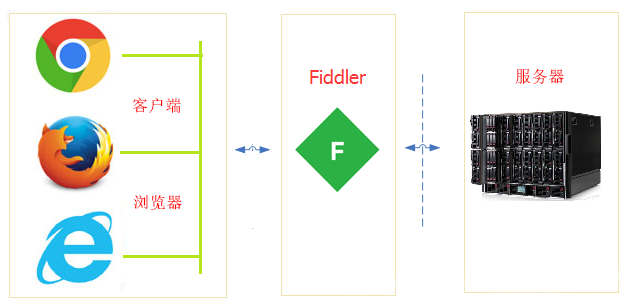
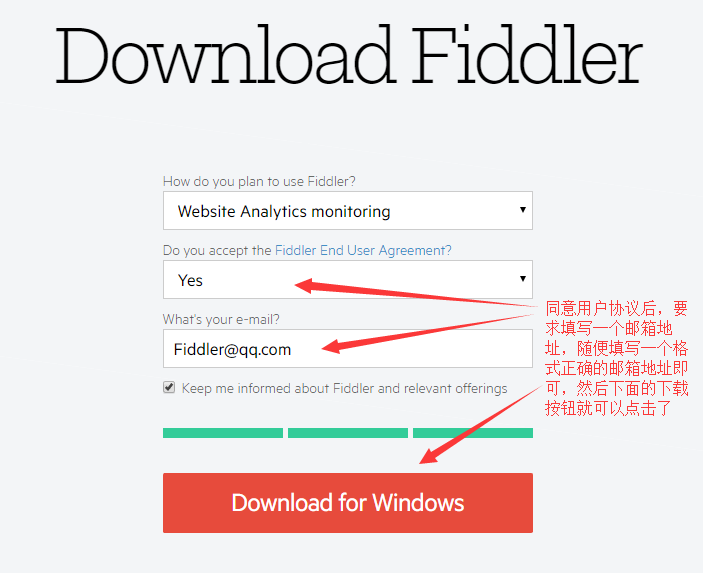
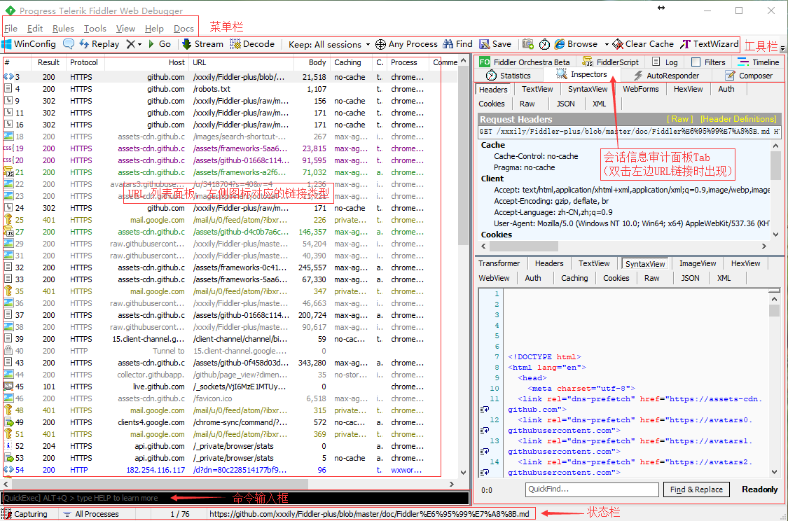

# 目录
* [Fiddler介绍](#Fiddler介绍)
  * [Fiddler是什么](#Fiddler是什么)
  * [Fiddler能做什么](#Fiddler能做什么)
  * [Fiddler的工作原理](#Fiddler的工作原理)
  * [为什么选择Fiddler](#为什么选择Fiddler)
* [Fiddler初级教程](#更多教程内容还在编写中...)
  * [完全的新手教程、主要讲解下载、安装、界面、选项等](#更多教程内容还在编写中...)
* [Fiddler中级教程](#Fiddler中级教程)
  * [主要讲解通过Fiddler提供的各种界面选项，命令选项等进行抓包调试、技巧等](#更多教程内容还在编写中...)
* [Fiddler高级教程](#更多教程内容还在编写中...)
  * [FiddlerScript 系统讲解，进行个性化定制、Fiddler plus 使用教程等](#更多教程内容还在编写中...)

## Fiddler是什么
Fiddler是位于客户端和服务器端的HTTP(s)代理，也是目前最常用的http(s)抓包工具之一 。   
它能够记录客户端和服务器之间的所有 HTTP请求，可以针对特定的HTTP请求，分析请求数据、设置断点、调试web应用、修改请求的数据，甚至可以修改服务器返回的数据，功能非常强大，是web调试的利器。

## Fiddler能做什么

* 进行任意平台(PC端、移动端等)、任意应用的抓包分析与开发调试
* 解决跨域开发时的接口、资源访问限制问题
* 进行多环境快速切换调试
* 快速调试线上脚本，排除故障
* 进行弱网络环境模拟测试，暴露应用在弱网下的用户体验
* 进行接口性能测试
* 自动化接口测试
* 模拟各种网络攻击
* 还有各种不可描述的功能...

## Fiddler的工作原理
Fiddler的本质是一个代理，既然是代理，也就是说：客户端的所有请求都要先经过Fiddler，然后转发到相应的服务器，反之，服务器端的所有响应，也都会先经过Fiddler然后发送到客户端。  
当我们启用Fiddler之后，IE的http(s)代理会自动被设置为127.0.0.1:8888(之所以这么设置是因为Fiddler默认监听的是8888端口)， 所有http(s)会话的都会被Fiddler拦截，web客户端和服务器的请求如下所示：  
  

至于Fiddler为啥可以抓https包，其实是利用了类似`中间人攻击`的技术，所以开启https抓包的时候需要安装个证书。

## 为什么选择Fiddler
说到抓包工具，稍微了解的都知道有很多类似的工具可用，例如：Wireshark、BurpSuite、Fiddler、Charles、HTTP Analyzer、HTTP Watch等，新兴的基于nodejs的还有：anyproxy、whistle等  
那么多抓包工具，为什么偏偏要选择Fiddler呢？  
原则上青菜萝卜各有所爱，每个人选择适合自己，能满足自己需求的即可。
但对于不熟悉各个工具特点的人，该如何选择适合自己的抓包软件，却是十分头痛的一件事，所以下面简单谈谈这些不同抓包工具的特点和适用范围：  
* [Wireshark](https://www.wireshark.org/) 是一款免费开源的网络封包分析软件，属于比较底层的抓包软件，需要比较专业的人员才能驾驭，主要面向网络管理员，网络安全工程师，普通人一般用它来学习网络协议等知识。
* [BurpSuite](https://portswigger.net/burp/) 虽然也可以抓包分析，但它是用于攻击web应用程序的集成平台，包含了很多工具集，可以对web应用进行安全评估，漏洞挖掘等。 如果你是个网络安全人员，或打算往网络安全方面发展，可以学习使用。ps:这是收费产品  
* [HTTP Analyzer](http://www.ieinspector.com/)、[HTTP Watch](http://www.httpwatch.com/)都是是比较老牌的HTTP抓包工具了，且都属收费产品，不能进行个性化定制或个性化定制功能较弱，从搜索结果和文章更新度来看已经比较少人使用了，所以个人也不推荐使用。
* [Charles](https://www.charlesproxy.com/) 界面简洁，功能强大，且同时支持Mac平台和Win平台，是不错的HTTP(s)捉包分析软件，但属于收费产品，个性化定制方面也比较弱，不喜欢折腾、且有点小钱的可以考虑。ps：什么？你有破解版？
* [Fiddler](http://www.telerik.com/fiddler) 功能强大，HTTP(s)类抓包软件应有的功能都有，而且是免费，但界面一般，配置界面繁杂（这也是功能强大的一个体现吧...）~好在拥有FiddlerScript，支持个性化定制，插件开发等,你完全可以通过它打造出一个属于自己的调试工具，当然前提是你要有一定的折腾精神。本文后面的高级教程将教你如何定制自己的Fiddler，打造一个高逼格且高效的Fiddler
* [anyproxy](https://github.com/alibaba/anyproxy)、[whistle](https://github.com/avwo/whistle) 是基于nodejs开发，具有良好的跨平台特性，而且源码开放，有很强的可定制性！非常适合喜欢折腾的极客“把玩”！当然目前也有不少缺点，例如进行https抓包时卡顿，存在一定的不稳定情况，anyproxy已经很久没人更新维护等。总的来说类免费、开源、跨平台的产品可以还需继续努力完善！希望有一天可以完全取代Fiddler吧！

## Fiddler初级教程

该部分纯粹为新手教程，主要讲解Fiddler的下载安装、界面、选项等，如果你不是新手，请跳过本章内容。
## 下载
Fiddler的官网地址为：http://www.telerik.com/fiddler  
下载地址：https://www.telerik.com/download/fiddler  
进入下载页面后你将看到如下界面：  
  
  
  
可以看到Fiddler要求你选择一个使用它的用途，随便选择一个选项即可，  
下面还有两个下载链接，一个是下载OS X（Mac）版本的Fiddler，另外一个是Linux版本的Fiddler，如果你有需要，可以点击下载安装，具体安装步骤和过程这里不介绍~  
  
选择用途后出现如下界面：  
  
      
 
 出现了是否同意使用的用户协议选项，选择Yes即可，然后又出现如下的填写用户邮箱界面：  
  
    
  
随便填写一个格式正确的邮箱地址即可点击下载按钮Z进行下载了，跳到下载页面，等待一段时间就会开始下载。
下载好后双击即可开始安装了。。。

如果你觉得以上步骤打开太慢，操作繁琐，可以到百度软件中心下载，详细地址请自行百度搜索：Fiddler 。

## 安装

## 基本界面和功能介绍
打开Fiddler，Fiddler主界面的布局如下：

  

主界面中包括六打常用的模块，其中：

1、Fiddler的菜单栏包含了大量的功能操作项和设置项
2、Fiddler的工具栏，也就是菜单栏下面的一栏，包含了常用的快捷操作按钮，如清除会话信息、开启/禁止解码功能、设置sessions面板（URL面板）最大显示条数、保存会话信息、重放操作等。

3、web Session面板，主要是Fiddler抓取到的每一条http请求（每一条称为一个session）,主要包含了请求的url，协议，状态码，body等信息，详细的字段含义如下：

 1.[#] -- HTTP 请求的链接类型图标和请求的顺序
 2.[Result] -- HTTP 响应的状态码，相关状态码信息可以参考   [这里] (https://segmentfault.com/a/1190000012282437) 和 [这里](http://tool.oschina.net/commons?type=5)
 3.[Protocol] -- 请求使用的协议（如 HTTP/HTTPS/WS ）
 4.[Host] -- 请求地址的域名
 5.[URL] -- 请求的服务器路径和文件名，也包括GET参数
 6.[Body] -- 请求的大小，以byte为单位
 7.[Caching] -- 请求的缓存过期时间或缓存控制的 header 值
 8.[Content-Type] -- 请求响应的类型（[Content-Type](http://tool.oschina.net/commons)）
 9.[Process] -- 发出此请求的 window 进程名称或进程ID
10.[Comments] -- 用户给此 session 增加的备注信息
11.[Custom] -- 用户可以通过脚本设置的自定义值

## 更多教程内容还在编写中...
太懒了，什么时候有冲动了再继续编写。。
~~更多教程内容还在编写中，如果你急不可耐，可以阅看下面的参考资料，教程将根据这些参考资料以及个人的经验进行编写~~

## 参考资料
https://www.qcloud.com/community/article/115124?fromSource=gwzcw.93596.93596.93596  
http://blog.csdn.net/ohmygirl/article/details/17846199  
[Fiddler调试权威指南 Debugging with Fiddle](https://item.jd.com/11398605.html)